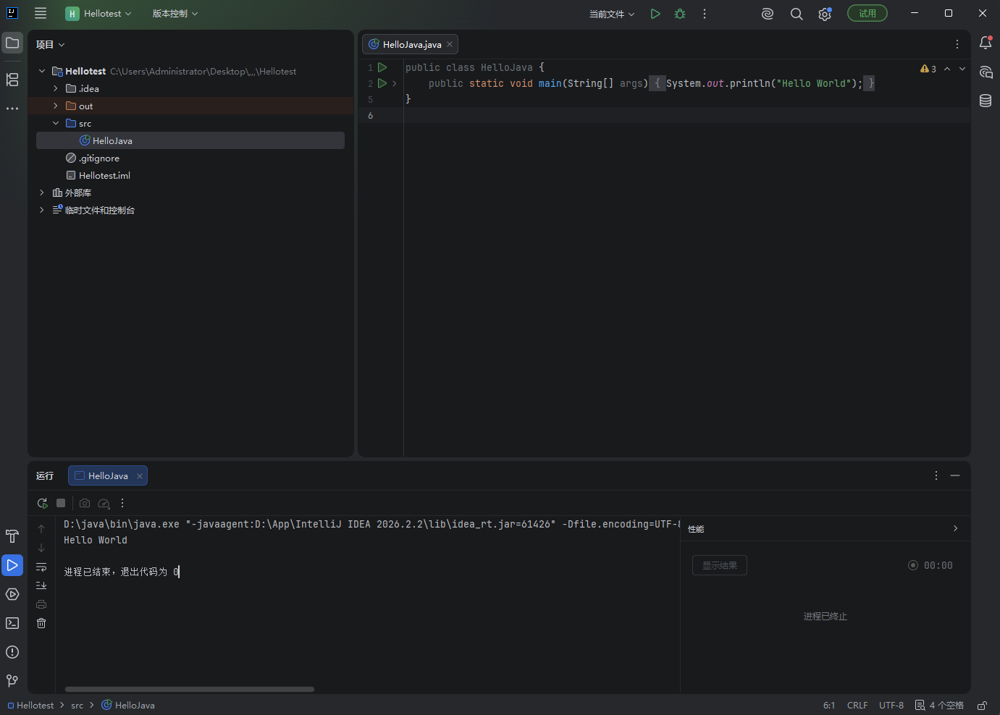
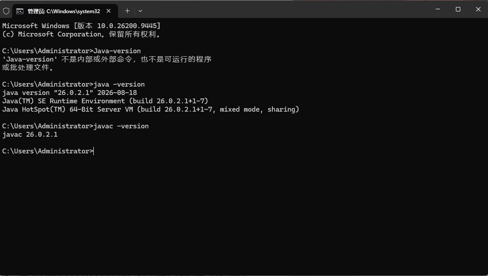

# TASK 1

1 JVM是java虚拟机，是翻译java字节码的工具。JRE是运行java程序的环境集合，包含了jvm以及JAVA核心类库。JDK是Java开发工具包，包含了JRE和很多开发工具 三者的关系是JDK包含JRE包含JVM

2安装好这些程序后，我们写的源代码就可以从人类能看懂的代码变为机器能读懂的字节码，再通过JVM的翻译让JAVA程序可以被正常运行

3版本号  java version "26.0.2.1" 

# TASK 2

1Path  作用：让操作系统通过 Path环境变量指定的路径去寻找对应的程序。将想运行的程序配置到环境变量Path后，以后便可以在任意位置使用这个程序

JAVA_HOME  作用：记录JDK安装的主文件夹路径，方便其他软件找到JDK位置，同时也方便修改JDK版本，避免损坏其他路径

2配置完成后，系统就会按照Path配置好的路径去找到java javac进而直接识别java javac

4HelloJava.java是编写出的源代码文件                                                                                                           HelloJava.class是通过javac翻译出的字节码文件，供JVM执行                                                                                     javac作用：将HelloJava,java里面的源代码翻译为.class的字节码文件供JVM使用                                                         java作用：启动JVM加载刚生成的class文件并执行，在屏幕上打印出Hello World

# TASK 3

1
